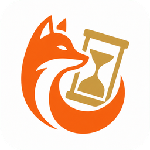

<p align="center">
  
</p>

<h1 align="center">ChronoFox · 크로노폭스</h1>

<p align="center">
  바탕화면에서 일정, 메모, 할 일을 한눈에.
  <br>
  Windows용 로컬 우선 개인 플래너
</p>

<p align="center">
  <a href="https://github.com/YuRang211/ChronoFox/releases">다운로드</a> ·
  <a href="#설치와-첫-사용">설치 안내</a> ·
  <a href="#업데이트">업데이트</a> ·
  <a href="https://github.com/YuRang211/ChronoFox/issues">문제 제보</a>
</p>

---

## 어떤 앱인가요?

ChronoFox는 Windows 바탕화면에 달력과 메모를 띄워두고, 일정·해야 할 일·시계 도구를 함께 관리하는 앱입니다. 일정과 메모는 내 PC에 저장하며, 로그인 없이 사용할 수 있습니다.

**현재 공개 버전: [0.8.9 베타](https://github.com/YuRang211/ChronoFox/releases/tag/v0.8.9)** · 한국어/영어 · 라이트/다크 테마

현재 베타 버전입니다. 중요한 데이터를 입력하기 전이나 업데이트 전에는 백업을 권장합니다.

## 주요 기능

| 기능 | 할 수 있는 일 |
|---|---|
| 바탕화면 달력 | 일정·공휴일 확인, 달마다·금주 중앙·금주 상단 정렬, 월요일/일요일 시작 선택 |
| 일정 관리 | 날짜별 노트와 시간 일정 작성, 시작 전 알림, 일·주 시간표 확인 |
| 스티커 메모 | 바탕화면 메모 작성, Markdown 미리보기, 로컬 이미지 드래그 연결, 보관·다시 열기 |
| 해야 할 일 | 1회성·반복 작업(일·주·월·분기·년), 나의 하루·중요·완료 필터, 목록과 단계 관리 |
| 시계 도구 | 타이머·스톱워치, 요일 반복·날짜 지정 알람, 스누즈 |
| 검색 | 노트·메모·할 일을 검색하고 해당 항목으로 이동 |
| 백업·내보내기 | ZIP 백업·복원, 다른 캘린더에서 사용할 ICS 내보내기 |

## 설치와 첫 사용

**[GitHub Releases에서 내려받기 →](https://github.com/YuRang211/ChronoFox/releases)**

| 배포 파일 | 용도 |
|---|---|
| `ChronoFox-x.y.z-Setup.exe` | 설치 마법사로 설치. 일반 사용자에게 권장 |
| `ChronoFox-x.y.z-portable.zip` | 압축을 풀고 실행. 설치 과정 없이 사용 |
| `SHA256SUMS.txt` | 다운로드 파일의 SHA-256 비교용 체크섬 |

### 설치본

1. `Setup.exe`를 내려받아 실행합니다.
2. 설치 마법사를 따라 진행한 뒤 시작 메뉴에서 **ChronoFox**를 엽니다.
3. 바탕화면 바로가기는 설치 중 선택할 수 있습니다.

관리자 권한이 필요 없는 개인 사용자용 설치입니다. 기본 설치 위치는 `%LOCALAPPDATA%\Programs\ChronoFox`입니다.

### 포터블

1. `portable.zip`을 원하는 폴더에 풉니다.
2. 폴더 안의 `ChronoFox.exe`를 실행합니다.

**0.8.9 포터블은 실행 파일 옆 `Data/` 폴더에 설정·일정·메모를 저장합니다.** 프로그램 폴더 전체를 복사하면 다른 PC나 드라이브로 손쉽게 이동할 수 있습니다. `portable.ini`는 포터블 모드 식별 파일이므로 삭제하지 마세요.

> **이전 버전에서 이동 시 주의:** 구형 포터블(0.8.8 이하)이나 설치본의 데이터는 자동으로 가져오지 않습니다. 기존 앱에서 **관리 → 설정 → 데이터 관리 → 백업 만들기(ZIP)**를 실행한 뒤, 새 포터블의 설정에서 **백업 복원**을 실행하세요.

### 처음 실행했다면

- 달력의 날짜에서 노트와 일정을 입력하고, **관리**에서 오늘·해야 할 일·주간·알람·보관을 확인합니다.
- 달력 메뉴나 트레이 메뉴에서 **새 메모**를 만들 수 있습니다.
- 타이머와 스톱워치는 달력 헤더 또는 트레이의 **시계 도구**에서 엽니다.
- 언어와 표시 설정은 **설정**에서 변경합니다. 처음 언어는 Windows 시스템 언어에 맞춰 선택됩니다.
- 창을 닫는 것과 앱 종료는 다릅니다. 완전히 종료하려면 트레이 메뉴의 **종료**를 사용하세요.

### Windows 실행 경고

현재 배포본은 코드 서명이 없어 Windows 실행 경고가 나타날 수 있습니다. 공식 Releases에서 받은 파일인지 확인하세요.

파일의 무결성을 확인하려면 같은 Release의 `SHA256SUMS.txt`와 아래 결과를 비교합니다.

```powershell
Get-FileHash .\ChronoFox-x.y.z-Setup.exe -Algorithm SHA256
```

## 업데이트

**관리 → 설정 → 정보 → 업데이트 확인**에서 새 버전을 확인합니다. 앱 시작 시 자동으로 확인하지 않습니다.

- 확인 전에는 현재 버전만 표시합니다.
- 새 버전이 있으면 같은 버튼이 **업데이트**로 바뀝니다.
- 설치본은 설치파일과 체크섬을 내려받아 SHA-256을 검사하고, 사용자 데이터의 사전 백업 후 설치 마법사를 실행합니다. 안내에 따라 진행하세요.
- 포터블·소스 실행은 파일을 자동 교체하지 않고 **다운로드 페이지 열기**를 제공합니다.
- 인터넷이나 서버에 연결할 수 없으면 안내가 표시되며 다시 확인할 수 있습니다.

새 소스가 GitHub에 올라오는 것만으로 설치된 앱이 업데이트되지는 않습니다. **설치파일이 포함된 새 Release**가 게시되어야 합니다.

## 데이터·백업
설치본과 소스 실행의 사용자 데이터는 `%USERPROFILE%\.desktop_note_calendar`에 저장됩니다. (0.8.9 포터블은 `ChronoFox.exe` 옆 `Data/` 폴더에 저장)

| 위치 | 내용 |
|---|---|
| `config.json` | 앱 설정 |
| `data.json` | 일정·할 일 등 앱 데이터 |
| `Notes` | 기본 메모 저장 폴더 |

메모 저장 폴더를 별도로 설정했다면 해당 경로도 확인하세요. 현재 공개 버전에는 Google 로그인·클라우드 동기화가 없습니다. 업데이트를 확인할 때는 GitHub에 연결합니다.

### ZIP 백업과 ICS의 차이

| 형식 | 사용 목적 |
|---|---|
| ZIP | ChronoFox의 설정·일정·할 일·알람·메모를 백업하고 복원 |
| ICS | 노트·시간 일정을 다른 캘린더 앱으로 가져오기. 전체 앱 백업을 대신하지 않음 |

설정의 백업·내보내기 항목에서 파일을 만들 수 있습니다. ZIP을 복원하면 현재 데이터가 교체되며, 복원 전에 롤백용 백업을 생성합니다. 복원 안내를 확인하고 앱을 다시 시작하세요.

**백업 ZIP은 암호화된 보관함이 아닙니다. 일정과 메모 등 개인정보가 포함되므로 공유·업로드에 주의하세요.** 자동 롤백 백업만 믿기보다 중요한 백업은 별도로 보관하는 것을 권장합니다.

### 앱 삭제

Windows **설정 → 앱 → 설치된 앱 → ChronoFox → 제거**에서 삭제할 수 있습니다. 프로그램·바로가기·자동실행 등록은 제거하지만 사용자 데이터는 보존합니다. 데이터까지 지우려면 먼저 필요한 백업을 만든 뒤 위 데이터 폴더와 별도로 지정한 메모 폴더를 확인하세요.

## 버전과 개발 상태

### 0.8.9 베타의 주요 변경

- **포터블 독립 Data 저장**: 포터블 실행 파일 옆 `Data/` 폴더에 설정·일정·메모를 저장하며, 프로그램 폴더 전체를 복사해 다른 PC/드라이브로 자유롭게 이동할 수 있습니다 (`portable.ini` 식별).
- **스티커 메모 로컬 이미지 연결**: 이미지 파일을 메모 편집기에 드래그 앤 드롭하면 본문 경로 연결을 통해 미리보기에 즉시 이미지가 표시됩니다.
- **설정 화면 개선**: 불필요한 검색바와 중복 패널을 정리하고 앱·달력·백업·정보 그룹으로 정돈하여 가독성을 높였습니다.
- **달력 디자인 미리보기**: 설정의 달력 디자인 목록에서 마우스 오버 시 팝업 미리보기를 제공하여 적용 전 디자인을 확인할 수 있습니다.
- **주간 위크보드**: 주간 7열 일정과 선택일 할 일 패널을 한눈에 볼 수 있는 주간 전용 디자인을 제공합니다.
- **모노 스튜디오 달력**: 웜화이트·먹색 및 오렌지 포인트의 타이포그래피 바탕화면 달력 테마를 추가했습니다.
- **보관함 활성 메모 표시**: 보관 목록에서 현재 열려 있는 메모 옆에 `● 활성` 배지를 표시합니다.
- **백업·내보내기 메뉴 통합**: ZIP 백업과 ICS 캘린더 내보내기를 단일 카드로 통합 정리했습니다.
- **반복 할 일 UX 개선**: 반복 스위치·시작일 지정, 분기(Quarterly) 반복 주기, 미래 회차 예정 분리 표시를 지원합니다.
- **전체 월 시트 정리**: 중복되던 전체 월 시트 설정을 데스크톱 작업판으로 통합했습니다.

### 0.8.8 베타의 주요 변경

- 복원 ZIP의 항목 수·비압축 크기·중앙 디렉터리 크기를 사전에 검사합니다.
- 달력 네 모서리에서 크기 조절, 주 시작 요일 선택, 주간 시간표 끝선 표시를 개선했습니다.
- 허브 앱 아이콘·업데이트 영역·빈 상태·섹션별 요약과 창 수명주기를 정리했습니다.
- ICS 식별자와 메모 Markdown 목록 표시를 보정했습니다.

전체 변경 기록과 다운로드 파일은 **[Releases](https://github.com/YuRang211/ChronoFox/releases)**에서 확인할 수 있습니다.

<details>
<summary>개발 중인 소스와 배포본의 차이</summary>

소스의 표시 버전이 같아도 아직 배포하지 않은 변경이 포함될 수 있습니다. 설치 사용자는 Release에 게시된 내용과 파일을 기준으로 확인하세요.

- 포터블 모드는 `portable.ini`가 실행 파일 옆에 있을 때만 활성화됩니다.
- 포터블의 프로그램 폴더를 삭제하면 안의 사용자 데이터(`Data/`)도 함께 삭제되므로 주의하세요.
- 포터블에서는 Windows 시작 시 자동실행을 지원하지 않습니다.
- 구형 포터블(0.8.8 이하)이나 설치본의 기존 데이터는 자동으로 가져오지 않으므로, 기존 앱에서 ZIP 백업을 만든 후 새 포터블에서 복원해야 합니다.
- 경로로 연결한 외부 이미지 파일은 ZIP 백업이나 프로그램 폴더 이동에 포함되지 않습니다 (원본 파일 경로 참조).

</details>

## 문제 제보

**[GitHub Issues](https://github.com/YuRang211/ChronoFox/issues)**에 아래 정보를 함께 남기면 원인을 확인하기 쉽습니다.

- 앱 버전과 설치본/포터블 여부
- 문제가 생기는 순서, 기대한 동작과 실제 동작
- Windows 버전, 화면 관련 문제라면 모니터별 해상도·배율
- 가능하면 개인정보를 가린 화면 캡처

메모 원문·일정·백업 파일·개인 경로를 공개 이슈에 그대로 올리지 마세요. 서로 다른 배율의 모니터 사이에서 창 크기가 달라지는 제보는 현재 조사 중입니다.

## 소스 실행·빌드

<details>
<summary>개발 환경과 실행 방법</summary>

Python 3.13과 PySide6를 사용하는 Windows 앱입니다. 가상환경을 만든 뒤 프로젝트 루트에서 실행합니다.

```powershell
py -3.13 -m venv .venv
.\.venv\Scripts\python.exe -m pip install -r requirements.txt
.\.venv\Scripts\python.exe .\desktop_note_calendar.py
```

`requirements.txt`에는 PySide6와 공휴일 표시용 `holidays`가 포함됩니다.

소스는 `chronofox/`의 데이터·도메인(`core`), 공용 UI(`ui`), 창(`windows`), 시계(`clock`), 관리 화면(`detail_schedule`), 자원(`assets`·`locales`)으로 나뉩니다. 루트의 `desktop_note_calendar.py`는 실행 진입점입니다.

테스트와 내부 개발 문서는 현재 공개 저장소에 포함하지 않습니다. 새 clone만으로 전체 테스트 환경이 갖춰지지는 않습니다.

</details>

<details>
<summary>배포 파일 빌드</summary>

개발 의존성을 설치하고 버전 일치 검사부터 실행합니다. 로컬 테스트 자료가 준비된 개발 환경에서 빌드하세요.

```powershell
.\.venv\Scripts\python.exe -m pip install -r requirements-dev.txt
# 가상환경의 도구를 빌드 스크립트에서 사용할 수 있게 현재 세션에 추가
$env:Path = "$PWD\.venv\Scripts;$env:Path"
.\build_release.ps1 -ValidateVersionOnly
.\build_release.ps1
```

빌드는 Ruff·테스트·PyInstaller·Inno Setup·ZIP·체크섬 생성 단계를 수행합니다. Inno Setup이 없으면 설치본 단계가 생략될 수 있으므로 **Setup.exe가 실제로 생성됐는지 확인해야 합니다.**

- 포터블 ZIP·`SHA256SUMS.txt`: `out/release/`
- 설치본: `installer/Output/`

버전은 `chronofox/core/app_constants.py`, `version_info.txt`, `installer/chronofox.iss`, `build_release.ps1`에서 일치해야 합니다. 빌드 스크립트는 GitHub Release를 자동 게시하지 않습니다.

</details>
